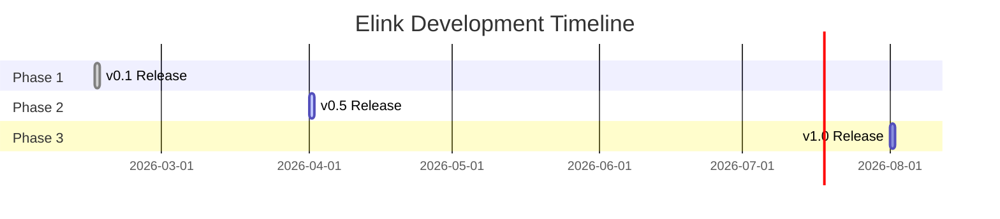
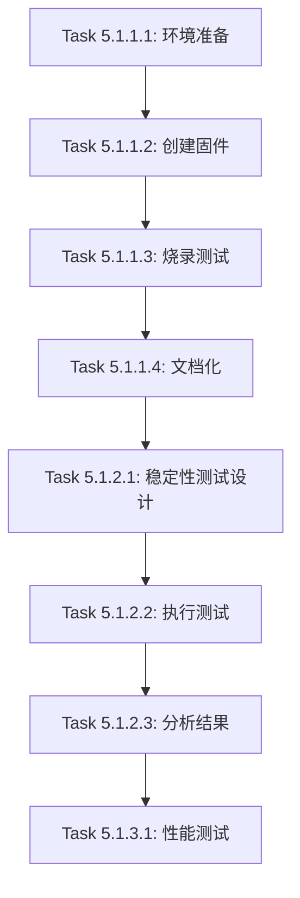

# 第一周高优先级任务详细计划

> 目标：完成开发前的核心准备工作
>
> 总预计时间：6-9 小时
>
> 建议完成时间：本周内（2026-02-09 ~ 2026-02-15）

---

## 任务概览

| 任务 | 预计时间 | 依赖 | 输出 | 状态 |
|------|---------|------|------|------|
| 任务 1: CI/CD 验证修复 | 1-2h | 无 | CI_STATUS_REPORT.md | ✅ 完成 |
| 任务 2: Roadmap 审查更新 | 2-3h | 任务1 | ROADMAP_V1.md | ✅ 完成 |
| 任务 3: 实施计划制定 | 3-4h | 任务2 | IMPLEMENTATION_PLAN.md | ⏳ 待开始 |

---

## 任务 1: CI/CD 验证和修复

**目标**: 确保所有 CI 测试通过，建立稳定的质量保障基础

**预计时间**: 1-2 小时

**优先级**: 🔴 最高（阻塞后续工作）

---

### 1.1 阶段一：CI 状态检查 (15-20 分钟)

#### 步骤 1: 查看 GitHub Actions 状态

```bash
# 在浏览器中访问
https://github.com/Raymond8196/elink-protocol/actions

# 记录以下信息：
# - 最近一次运行的状态（成功/失败）
# - 失败的具体任务名称
# - 错误信息摘要
```

**输出**:
```markdown
## CI 当前状态

### 最后运行时间: YYYY-MM-DD HH:MM
### Commit: [commit hash]
### 总体状态: ✅/❌

### 各任务状态:
- [ ] Format Check: ✅/❌
- [ ] Clippy (no_std): ✅/❌
- [ ] Clippy (std): ✅/❌
- [ ] Clippy (default): ✅/❌
- [ ] Test Features (stable): ✅/❌
- [ ] Test Features (beta): ✅/❌
- [ ] Test Features (nightly): ✅/❌
- [ ] Test Adapter: ✅/❌
- [ ] Test Examples: ✅/❌
- [ ] Check Embedded Targets: ✅/❌
- [ ] Documentation: ✅/❌

### 失败任务详情:
[如果有失败，复制错误信息]
```

#### 步骤 2: 本地模拟 CI 测试

```bash
cd ~/wkspaces/rmk_q/rmk/elink-protocol

# 1. 格式检查
echo "=== Format Check ==="
cargo fmt --all -- --check
echo "Result: $?"

# 2. Clippy no_std
echo -e "\n=== Clippy no_std ==="
cargo clippy --all-targets --no-default-features -- -D warnings
echo "Result: $?"

# 3. Clippy std
echo -e "\n=== Clippy std ==="
cargo clippy --all-targets --features std -- -D warnings
echo "Result: $?"

# 4. Clippy default
echo -e "\n=== Clippy default ==="
cargo clippy --all-targets -- -D warnings
echo "Result: $?"

# 5. Tests
echo -e "\n=== Tests ==="
cargo test --all --features std
echo "Result: $?"

# 6. 嵌入式目标检查
echo -e "\n=== Embedded Targets ==="
rustup target add thumbv7em-none-eabihf
cargo check --package elink-core --target thumbv7em-none-eabihf --no-default-features
echo "Result: $?"
```

**检查清单**:
- [ ] 所有命令都返回 0（成功）
- [ ] 没有 warnings
- [ ] 没有 format diff
- [ ] 测试全部通过

---

### 1.2 阶段二：问题诊断和修复 (30-60 分钟)

#### 常见问题和解决方案

**问题 1: 格式错误**
```bash
# 诊断
cargo fmt --all -- --check

# 修复
cargo fmt --all

# 验证
git diff  # 查看格式变化
```

**问题 2: Clippy 警告**
```bash
# 查看详细警告
cargo clippy --all-targets --features std -- -D warnings 2>&1 | tee clippy.log

# 常见修复：
# - 未使用的导入: 删除或添加 #[allow(unused_imports)]
# - 未使用的变量: 添加下划线前缀 _var 或删除
# - 类型转换: 使用正确的转换方法
# - 不必要的借用: 移除多余的 &
```

**问题 3: 测试失败**
```bash
# 运行单个失败的测试
cargo test test_name -- --nocapture

# 查看测试覆盖的代码
# 分析失败原因
# 修复代码或测试
```

**问题 4: 嵌入式目标编译失败**
```bash
# 常见原因：
# - 使用了 std 特性
# - 缺少 #![no_std]
# - 依赖项不支持 no_std

# 修复：
# - 确保所有代码在 no_std 下编译
# - 使用 #[cfg(feature = "std")] 条件编译
# - 检查依赖项的 default-features = false
```

#### 修复流程

```bash
# 1. 修复代码
# 编辑相关文件...

# 2. 本地验证
cargo check --all
cargo test --all --features std
cargo clippy --all-targets -- -D warnings

# 3. 提交修复
git add -A
git commit -m "fix(ci): resolve [specific issue]

Detailed description of what was fixed and why.

Fixes #[issue-number] (if applicable)"

# 4. 推送
git push origin main
```

**检查清单**:
- [ ] 所有本地测试通过
- [ ] 代码已提交
- [ ] 已推送到 GitHub
- [ ] CI 重新运行中

---

### 1.3 阶段三：验证和文档 (15-20 分钟)

#### 步骤 1: 等待 CI 完成并验证

```bash
# 访问 Actions 页面
https://github.com/Raymond8196/elink-protocol/actions

# 确认所有检查通过
```

#### 步骤 2: 创建 CI 状态报告

**模板**: `docs/CI_STATUS_REPORT.md`

```markdown
# CI 状态报告

**日期**: 2026-02-XX
**提交**: [commit hash]
**报告人**: [你的名字]

## 执行摘要

✅ 所有 CI 检查通过

## 测试结果

### 格式检查
- 状态: ✅
- 耗时: Xs

### Clippy 检查
- no_std: ✅ (Xs)
- std: ✅ (Xs)
- default: ✅ (Xs)

### 功能测试
- stable: ✅ (Xs)
- beta: ✅ (Xs)
- nightly: ✅ (Xs)

### 嵌入式目标
- thumbv7em-none-eabihf: ✅
- thumbv6m-none-eabi: ✅
- riscv32imac: ✅

### 文档构建
- 状态: ✅
- 耗时: Xs

## 修复的问题

### Issue #1: [问题描述]
- **原因**: ...
- **修复**: ...
- **提交**: [commit hash]

### Issue #2: [问题描述]
- **原因**: ...
- **修复**: ...
- **提交**: [commit hash]

## 测试覆盖率

[如果运行了覆盖率测试]
- 总覆盖率: XX%
- elink-core: XX%
- elink-rmk-adapter: XX%

## 性能基准

[如果运行了 benchmark]
- 编码延迟: XX µs
- 解码延迟: XX µs
- 内存占用: XX bytes

## 建议

- [ ] 增加测试覆盖率到 XX%
- [ ] 添加性能回归检测
- [ ] 配置 dependabot

## 下一步

✅ CI 稳定，可以进入 Roadmap 规划阶段
```

**检查清单**:
- [ ] CI 全部通过
- [ ] 状态报告已创建
- [ ] 报告已提交到 git

---

### 1.4 任务 1 验收标准

- [x] GitHub Actions 所有检查显示绿色 ✅
- [x] 本地运行所有 CI 命令均通过
- [x] CI_STATUS_REPORT.md 已创建并提交
- [x] README 中的 CI 徽章显示 passing
- [x] 没有遗留的 warnings 或 errors

**时间检查点**:
- 如果超过 2 小时仍未完成，记录问题并寻求帮助

---

## 任务 2: Roadmap 详细审查和更新

**目标**: 制定清晰的版本规划和发展路线图

**预计时间**: 2-3 小时

**依赖**: 任务 1 完成

**优先级**: 🔴 高

---

### 2.1 阶段一：现状分析 (30-40 分钟)

#### 步骤 1: 审查现有 Roadmap

```bash
# 阅读现有文档
cd ~/wkspaces/rmk_q/rmk
cat docs/integrations/elink/roadmap.md
cat docs/integrations/elink/roadmap-zh.md
```

**分析要点**:
1. 哪些功能已完成？
2. 哪些功能正在进行？
3. 哪些功能的优先级需要调整？
4. 是否有新的需求需要添加？
5. 时间估算是否合理？

**输出**: 分析笔记
```markdown
## Roadmap 现状分析

### 已完成功能（Phase 1-4）
- ✅ 核心协议实现
- ✅ RMK 集成
- ✅ 优化
- ✅ 测试和文档

### 当前阶段（Phase 5）
- 🚧 硬件验证
  - 进度: 0% (未开始)
  - 阻塞因素: 等待硬件

### 计划功能（Phase 6-7）
- ⏳ 高级功能
  - 重试机制
  - 动态优先级
  - 多外设优化
  - 压缩支持

### 需要调整的内容
1. [列出需要更新的部分]
2. [新增的需求]
3. [时间线调整]

### 缺失的内容
1. 没有明确的版本号定义
2. 缺少里程碑和交付物
3. 时间估算不够具体
4. 缺少风险评估
```

---

#### 步骤 2: 版本定义讨论

**需要回答的问题**:

**v0.1 - 最小可用版本**
```markdown
## v0.1 功能范围讨论

### 核心问题
1. v0.1 的目标用户是谁？
   - [ ] 开发者自己测试
   - [ ] 早期采用者
   - [ ] 社区试用

2. v0.1 必须包含哪些功能？
   - [ ] 基本的帧编码/解码
   - [ ] RMK 集成工作
   - [ ] 文档齐全
   - [ ] 通过所有测试
   - [ ] 其他: _______

3. v0.1 可以不包含哪些？
   - [ ] 高级功能（压缩、加密）
   - [ ] 多设备支持
   - [ ] 性能优化
   - [ ] 完整的硬件验证
   - [ ] 其他: _______

4. v0.1 的发布标准？
   - [ ] CI 全部通过
   - [ ] 至少 XX% 测试覆盖率
   - [ ] 在 X 个平台上测试过
   - [ ] 文档完整
   - [ ] 其他: _______

### 我的建议
v0.1 = 当前代码 + CI 稳定 + 基本文档
- 目标: 证明概念可行
- 用户: 主要是自己使用和测试
- 时间: 已基本完成（本周）
```

**v0.5 - 功能稳定版**
```markdown
## v0.5 功能范围讨论

### 核心问题
1. v0.5 与 v0.1 的主要区别？
   - [ ] 硬件验证完成
   - [ ] 性能优化完成
   - [ ] 稳定性测试通过
   - [ ] 可以推荐他人使用
   - [ ] 其他: _______

2. v0.5 必须解决的问题？
   - [ ] 已知的 bug 全部修复
   - [ ] 在真实硬件上验证
   - [ ] 长期稳定性测试
   - [ ] 性能达标
   - [ ] 其他: _______

3. v0.5 的硬件覆盖？
   - [ ] STM32H7 (必须)
   - [ ] nRF52840 (必须)
   - [ ] RP2040 (可选)
   - [ ] ESP32 (可选)

4. v0.5 的时间预期？
   - [ ] 1 个月
   - [ ] 2 个月
   - [ ] 3 个月
   - [ ] 更长: _______

### 我的建议
v0.5 = 硬件验证 + 稳定性 + 性能优化
- 目标: 生产就绪
- 用户: 可以在实际项目中使用
- 时间: 2-3 个月
```

**v1.0 - 正式发布**
```markdown
## v1.0 发布标准讨论

### 核心问题
1. v1.0 意味着什么？
   - [ ] 协议稳定（不再有破坏性更改）
   - [ ] 完整的文档
   - [ ] 社区验证
   - [ ] 性能基准明确
   - [ ] 其他: _______

2. v1.0 必须包含的功能？
   - [ ] 基本协议（已有）
   - [ ] 重试机制
   - [ ] 多设备支持
   - [ ] 完整的硬件兼容性
   - [ ] 其他: _______

3. v1.0 的质量标准？
   - [ ] XX% 测试覆盖率
   - [ ] X 个月稳定运行
   - [ ] XX 个生产项目使用
   - [ ] 社区贡献 X+ PRs
   - [ ] 其他: _______

4. v1.0 的时间预期？
   - [ ] 6 个月
   - [ ] 1 年
   - [ ] 更长: _______

### 我的建议
v1.0 = 社区验证 + 协议冻结 + 完整生态
- 目标: 成为标准解决方案
- 用户: 任何人都可以放心使用
- 时间: 6-12 个月
```

---

### 2.2 阶段二：Roadmap 更新 (60-90 分钟)

#### 步骤 1: 创建详细的 Roadmap

**文档结构**: `docs/ROADMAP_V1.md`

```markdown
# Elink Protocol Roadmap v1.0

**文档版本**: 1.0
**最后更新**: 2026-02-XX
**负责人**: [你的名字]

---

## 愿景

Elink 成为嵌入式设备（特别是键盘）之间通信的标准协议，
以可靠性、性能和易用性著称。

---

## 里程碑总览



| 版本 | 发布日期 | 状态 | 主要目标 |
|------|---------|------|---------|
| v0.1 | 2026-02-15 | ⏳ 进行中 | 概念验证 |
| v0.5 | 2026-04-01 | 📋 计划中 | 生产就绪 |
| v1.0 | 2026-08-01 | 📋 计划中 | 正式发布 |

---

## v0.1 - 概念验证版 (MVP)

**目标**: 证明 Elink 协议的可行性和基本功能

**发布日期**: 2026-02-15 (本周)

**状态**: 🔄 90% 完成

### 功能范围

**包含**:
- ✅ 核心协议实现
  - Compatible Frame (8 字节)
  - Standard Frame (8-64 字节)
  - CRC-4/CRC-16 校验
  - 4 级优先级系统

- ✅ RMK 集成
  - ElinkSplitDriver 实现
  - SplitMessage 映射
  - 基本示例代码

- ✅ 文档
  - 协议规范（EN + ZH）
  - 集成指南
  - API 文档
  - FAQ

- 🔄 质量保障
  - CI/CD 配置
  - 单元测试
  - 格式和 Linting

**不包含**:
- ❌ 硬件验证
- ❌ 性能优化
- ❌ 高级功能
- ❌ 多设备支持

### 验收标准

- [ ] CI 全部通过
- [ ] 测试覆盖率 > 60%
- [ ] 文档完整且可读
- [ ] 在模拟环境中运行成功
- [ ] 代码通过 clippy 检查

### 交付物

- [x] elink-protocol 仓库 (GitHub)
- [x] 完整文档
- [ ] CI 状态报告
- [ ] v0.1 Release Notes

### 已知问题

- 未在实际硬件上测试
- 性能未优化
- 缺少某些边界情况的测试

---

## v0.5 - 生产就绪版

**目标**: 在真实硬件上验证，达到生产可用水平

**发布日期**: 2026-04-01 (预计 6-8 周)

**状态**: 📋 计划中

### 功能范围

**Phase 5: 硬件验证** (Week 3-6)

Epic 5.1: STM32H7 平台验证
- [ ] Story 5.1.1: 基本通信测试
  - Task: 编译固件
  - Task: 烧录到 STM32H7
  - Task: 运行基础测试
  - 验收: 能成功收发消息
  - 预计: 4 小时

- [ ] Story 5.1.2: 稳定性测试
  - Task: 24 小时连续运行
  - Task: 压力测试（高频输入）
  - Task: 边界条件测试
  - 验收: 无崩溃，错误率 < 0.1%
  - 预计: 8 小时 + 等待时间

- [ ] Story 5.1.3: 性能测试
  - Task: 延迟测试
  - Task: 吞吐量测试
  - Task: 内存占用分析
  - 验收: 符合性能目标
  - 预计: 4 小时

Epic 5.2: nRF52840 平台验证
- [ ] Story 5.2.1: BLE split 集成
- [ ] Story 5.2.2: 无线稳定性测试
- [ ] Story 5.2.3: 功耗测试

Epic 5.3: 问题修复
- [ ] Bug 修复
- [ ] 性能优化
- [ ] 文档更新

**Phase 5.5: 优化和完善** (Week 7-8)
- [ ] Epic 5.4: 性能优化
- [ ] Epic 5.5: 测试覆盖率提升到 80%
- [ ] Epic 5.6: 用户文档完善

### 验收标准

- [ ] 在 2+ 硬件平台上验证通过
- [ ] 24 小时稳定性测试通过
- [ ] 性能达标（延迟 < 50µs）
- [ ] 测试覆盖率 > 80%
- [ ] 文档更新完整
- [ ] 至少 1 个外部用户成功集成

### 交付物

- [ ] v0.5 Release
- [ ] 硬件验证报告
- [ ] 性能基准报告
- [ ] 更新的集成指南
- [ ] 示例项目

### 风险

- **硬件可用性**: 需要实际硬件进行测试
  - 缓解: 提前准备硬件，或使用模拟器

- **时间不足**: 硬件调试可能耗时
  - 缓解: 预留 buffer 时间

- **性能不达标**: 可能需要重构
  - 缓解: 早期性能测试，提前发现问题

---

## v1.0 - 正式发布版

**目标**: 协议稳定，社区验证，成为标准方案

**发布日期**: 2026-08-01 (预计 6 个月)

**状态**: 📋 计划中

### 功能范围

**Phase 6: 高级功能** (Week 9-16)

Epic 6.1: 自动重试机制
- [ ] 设计重试策略
- [ ] 实现重试逻辑
- [ ] 测试和验证
- 预计: 1 周

Epic 6.2: 动态优先级
- [ ] 设计优先级调整算法
- [ ] 实现
- [ ] 性能测试
- 预计: 2 周

Epic 6.3: 多外设支持
- [ ] 设计路由机制
- [ ] 实现 3+ 设备通信
- [ ] 测试复杂拓扑
- 预计: 2 周

Epic 6.4: 可选功能
- [ ] 压缩支持 (optional)
- [ ] 加密支持 (optional)
- [ ] 遥测统计 (optional)
- 预计: 3 周

**Phase 7: 社区和生态** (Week 17-24)

Epic 7.1: 社区验证
- [ ] 至少 3 个外部项目使用
- [ ] 收集反馈和改进
- [ ] Bug 修复

Epic 7.2: 生态建设
- [ ] QMK 移植 (社区驱动)
- [ ] ZMK 移植 (社区驱动)
- [ ] 工具开发
  - 协议分析器
  - Wireshark 插件

Epic 7.3: 文档完善
- [ ] 视频教程
- [ ] 更多示例
- [ ] 最佳实践指南

### 验收标准

- [ ] 协议版本冻结（无破坏性更改）
- [ ] 3+ 硬件平台支持
- [ ] 3+ 生产项目使用
- [ ] 测试覆盖率 > 85%
- [ ] 完整的生态工具
- [ ] 社区活跃（Issues, PRs, Discussions）

### 交付物

- [ ] v1.0 Release
- [ ] 完整的协议规范（RFC 风格）
- [ ] 多平台示例项目
- [ ] 工具套件
- [ ] 最佳实践文档
- [ ] 发布公告和推广

---

## 技术债务跟踪

### 当前技术债
1. **测试覆盖率不足**: 当前约 60%，目标 80%+
   - 优先级: 中
   - 计划: v0.5 完成

2. **性能未优化**: 未在实际硬件上测试
   - 优先级: 高
   - 计划: v0.5 完成

3. **文档缺少示例**: 需要更多实际案例
   - 优先级: 中
   - 计划: v1.0 完成

### 未来可能的债务
- 多设备路由的复杂性
- 向后兼容性维护成本

---

## 资源需求

### 开发资源
- **开发时间**: 平均 10-15 小时/周
- **硬件**: STM32H7, nRF52840, RP2040 开发板
- **工具**: 逻辑分析仪（可选）

### 社区资源
- **早期采用者**: 需要 3-5 个愿意试用的开发者
- **代码审查**: 希望有经验的 Rust 开发者帮助
- **测试**: 需要多平台测试反馈

---

## 风险管理

### 高风险项
1. **硬件可用性**
   - 影响: 无法进行实际测试
   - 概率: 低
   - 缓解: 提前购买/借用硬件

2. **性能不达标**
   - 影响: 需要重构核心代码
   - 概率: 中
   - 缓解: 早期性能测试，预留优化时间

3. **社区采用度低**
   - 影响: 缺少反馈和验证
   - 概率: 中
   - 缓解: 主动推广，提供良好文档

### 中风险项
1. **时间延期**
   - 缓解: 保守估算，预留 buffer

2. **API 不稳定**
   - 缓解: 早期冻结核心 API

---

## 成功指标

### v0.1 成功指标
- [x] CI 通过率 100%
- [ ] 文档完整性 > 90%
- [ ] 代码质量评分 A

### v0.5 成功指标
- [ ] 硬件测试通过率 100%
- [ ] 性能达标（延迟 < 50µs）
- [ ] 至少 1 个外部采用

### v1.0 成功指标
- [ ] 3+ 生产项目使用
- [ ] GitHub Stars > 100
- [ ] 社区月活跃度 > 10

---

## 版本历史

- **v1.0** (2026-02-XX): 初始详细 Roadmap
- **v0.5** (之前): 基础 Roadmap

---

## 反馈和更新

这是一个活文档，会根据实际进展调整。

**更新频率**: 每 2 周或在重要里程碑后

**反馈渠道**:
- GitHub Issues
- GitHub Discussions
- 直接讨论

---
```

**检查清单**:
- [ ] 版本定义清晰
- [ ] 时间线合理
- [ ] 任务可执行
- [ ] 风险已识别
- [ ] 指标可衡量

---

### 2.3 阶段三：讨论和确认 (20-30 分钟)

#### 讨论要点

**关于版本定义**:
- [ ] v0.1/v0.5/v1.0 的范围是否合理？
- [ ] 时间估算是否现实？
- [ ] 是否有遗漏的关键功能？

**关于优先级**:
- [ ] Phase 5 (硬件验证) 的优先级是否最高？
- [ ] 高级功能（重试、多设备）是否必须在 v1.0？
- [ ] 社区建设应该什么时候开始？

**关于风险**:
- [ ] 识别的风险是否完整？
- [ ] 缓解策略是否可行？
- [ ] 是否需要 Plan B？

**关于资源**:
- [ ] 开发时间预估（10-15h/周）是否可行？
- [ ] 硬件资源是否已准备？
- [ ] 是否需要寻求社区帮助？

#### 确认和调整

基于讨论结果，更新 Roadmap 文档。

---

### 2.4 任务 2 验收标准

- [ ] ROADMAP_V1.md 已创建
- [ ] 版本定义清晰（v0.1, v0.5, v1.0）
- [ ] 每个版本都有：
  - [ ] 功能范围
  - [ ] 验收标准
  - [ ] 时间估算
  - [ ] 风险识别
- [ ] 已与自己充分讨论并确认
- [ ] 文档已提交到 git

**时间检查点**:
- 如果超过 3 小时，记录剩余问题，先完成主体部分

---

## 任务 3: 开发实施计划制定

**目标**: 将 Roadmap 转化为可执行的开发计划

**预计时间**: 3-4 小时

**依赖**: 任务 2 完成

**优先级**: 🔴 高

---

### 3.1 阶段一：任务分解 (90-120 分钟)

#### 步骤 1: Epic → Story → Task 分解

**选择 v0.5 的一个 Epic 作为示例**:

```markdown
## Epic 5.1: STM32H7 平台验证

**目标**: 在 STM32H7 上验证 Elink 协议

**预计时间**: 16 小时

**优先级**: 🔴 最高

---

### Story 5.1.1: 基本通信测试

**描述**:
在 STM32H7 开发板上编译、烧录 Elink 固件，
验证基本的收发消息功能。

**验收标准**:
- [ ] 固件成功编译（无 errors）
- [ ] 固件成功烧录到开发板
- [ ] 能够发送测试消息
- [ ] 能够接收测试消息
- [ ] 消息内容正确无误
- [ ] CRC 校验通过

**预计时间**: 4 小时

---

#### Task 5.1.1.1: 准备开发环境

**描述**: 配置 STM32H7 开发环境

**步骤**:
```bash
# 1. 安装目标
rustup target add thumbv7em-none-eabihf

# 2. 安装工具
cargo install probe-rs --features cli

# 3. 验证硬件连接
probe-rs list

# 4. 检查示例是否存在
ls examples/use_rust/ | grep stm32h7
```

**验收**:
- [ ] 目标已安装
- [ ] probe-rs 工作正常
- [ ] 能检测到开发板

**预计时间**: 30 分钟

---

#### Task 5.1.1.2: 创建测试固件

**描述**: 基于现有示例创建测试固件

**步骤**:
```rust
// 在 examples/use_rust/stm32h7_elink_test/

// 1. 创建项目结构
// 2. 配置 Cargo.toml
// 3. 编写 main.rs
//    - 初始化 UART
//    - 创建 ElinkSplitDriver
//    - 发送测试消息
//    - 接收并验证
// 4. 添加调试输出
```

**验收**:
- [ ] 代码编译通过
- [ ] 没有 warnings
- [ ] 有清晰的调试输出

**预计时间**: 2 小时

---

#### Task 5.1.1.3: 烧录和测试

**描述**: 烧录固件并运行测试

**步骤**:
```bash
# 1. 编译
cargo build --release --target thumbv7em-none-eabihf

# 2. 烧录
probe-rs run --chip STM32H750VBTx target/.../firmware

# 3. 监控输出
# (通过 RTT 或 Serial)

# 4. 记录结果
```

**验收**:
- [ ] 烧录成功
- [ ] 固件运行
- [ ] 能看到调试输出
- [ ] 测试通过

**预计时间**: 1 小时

---

#### Task 5.1.1.4: 文档化结果

**描述**: 记录测试结果和问题

**输出**: `docs/hw_test/stm32h7_basic_test.md`

**验收**:
- [ ] 测试步骤清晰
- [ ] 结果有截图/日志
- [ ] 问题已记录

**预计时间**: 30 分钟

---

### Story 5.1.2: 稳定性测试

[类似的分解...]

### Story 5.1.3: 性能测试

[类似的分解...]
```

**完成所有 Epic 的分解**

---

#### 步骤 2: 创建任务依赖图



---

### 3.2 阶段二：制定迭代计划 (60-90 分钟)

#### 步骤 1: 定义迭代周期

**建议**: 2 周迭代（Sprint）

```markdown
## 迭代计划

### Sprint 1 (Week 1-2): 基础设施
- 目标: CI 稳定，Roadmap 完成，计划制定
- 交付: v0.1 准备完成
- 时间: 2026-02-09 ~ 2026-02-22

### Sprint 2 (Week 3-4): 硬件验证 - Phase 1
- 目标: STM32H7 基本验证
- 交付: 基本通信工作，初步测试报告
- 时间: 2026-02-23 ~ 2026-03-08

### Sprint 3 (Week 5-6): 硬件验证 - Phase 2
- 目标: STM32H7 完整验证 + nRF52840 开始
- 交付: STM32H7 验证报告，nRF52840 基础测试
- 时间: 2026-03-09 ~ 2026-03-22

[... 后续 Sprint ...]
```

---

#### 步骤 2: 优先级排序

使用 MoSCoW 方法:

```markdown
## 任务优先级

### Must Have (v0.5 必须)
1. 🔴 STM32H7 基本验证
2. 🔴 nRF52840 BLE 验证
3. 🔴 稳定性测试通过
4. 🔴 性能达标
5. 🔴 Bug 修复

### Should Have (v0.5 应该有)
6. 🟡 RP2040 验证
7. 🟡 测试覆盖率 80%
8. 🟡 性能优化
9. 🟡 文档完善

### Could Have (v0.5 可以有)
10. 🟢 ESP32 验证
11. 🟢 示例项目
12. 🟢 视频教程

### Won't Have (v0.5 不做)
- ❌ 高级功能
- ❌ QMK/ZMK 移植
- ❌ 工具开发
```

---

### 3.3 阶段三：风险和应对 (30-40 分钟)

#### 识别风险

```markdown
## 风险登记册

| ID | 风险 | 概率 | 影响 | 分数 | 应对策略 |
|----|------|------|------|------|---------|
| R1 | 硬件不可用 | 低 | 高 | 中 | 提前采购，备用模拟器 |
| R2 | 性能不达标 | 中 | 高 | 高 | 早期测试，预留优化时间 |
| R3 | 时间不足 | 中 | 中 | 中 | 保守估算，砍掉非核心功能 |
| R4 | Bug 难以定位 | 中 | 中 | 中 | 增加日志，使用调试器 |
| R5 | 社区无反馈 | 中 | 低 | 低 | 主动推广，降低使用门槛 |

**风险分数**: 概率 × 影响
- 高 (>6): 需要立即应对
- 中 (3-6): 监控并准备
- 低 (<3): 记录即可
```

#### 制定应对计划

```markdown
## 高风险应对计划

### R2: 性能不达标

**预防措施**:
1. Week 3 就开始性能测试（提前 3 周）
2. 设置性能监控基准
3. 每次改动都跑 benchmark

**应急措施**:
如果性能不达标：
1. 分析瓶颈（profiling）
2. 优化热点代码
3. 如果无法优化，调整性能目标
4. 最坏情况：延期发布 v0.5

**责任人**: 你自己
**检查频率**: 每周
```

---

### 3.4 阶段四：文档化 (20-30 分钟)

#### 创建实施计划文档

**文档**: `docs/IMPLEMENTATION_PLAN.md`

**结构**:
```markdown
# Elink 开发实施计划 v1.0

## 执行摘要
- 总时间: 6 个月
- 迭代: 12 个 sprints (每个 2 周)
- 里程碑: 3 个 (v0.1, v0.5, v1.0)

## Sprint 详细计划
[每个 Sprint 的详细内容]

## 任务分解
[Epic → Story → Task]

## 依赖关系
[依赖图]

## 优先级排序
[MoSCoW]

## 风险管理
[风险登记册和应对计划]

## 资源分配
[时间、硬件、人力]

## 沟通计划
[Review 频率，反馈机制]

## 附录
[参考文档，工具清单]
```

---

### 3.5 任务 3 验收标准

- [ ] IMPLEMENTATION_PLAN.md 已创建
- [ ] 至少一个 Epic 完整分解到 Task 级别
- [ ] Sprint 计划清晰（至少前 4 个 Sprint）
- [ ] 优先级明确
- [ ] 风险已识别和应对
- [ ] 文档已提交到 git

**时间检查点**:
- 如果超过 4 小时，完成核心部分（前 2 个 Sprint 的详细计划）

---

## 周总结和下周预览

### 本周完成

**完成标志**:
- [x] CI 全部通过 ✅
- [x] CI_STATUS_REPORT.md
- [x] ROADMAP_V1.md
- [x] IMPLEMENTATION_PLAN.md
- [x] 充分讨论和确认

**成果**:
- 📊 清晰的版本规划
- 📋 可执行的开发计划
- 🎯 明确的里程碑
- ⚠️ 识别的风险

### 下周预览

**如果进展顺利**，下周可以：
1. 开始 Sprint 2 的实际开发工作
2. 或者继续完善准备工作（如测试覆盖率）

**如果需要更多时间**，继续完善：
- 测试策略文档
- 性能基准
- 文档完善

---

## 检查清单汇总

### 任务 1: CI/CD
- [ ] GitHub Actions 状态确认
- [ ] 所有本地测试通过
- [ ] CI_STATUS_REPORT.md 完成
- [ ] CI 徽章显示 passing

### 任务 2: Roadmap
- [ ] 现有 roadmap 分析完成
- [ ] 版本定义讨论并确认
- [ ] ROADMAP_V1.md 创建
- [ ] 包含版本、时间、功能、风险

### 任务 3: 实施计划
- [ ] 任务分解（至少一个 Epic）
- [ ] Sprint 计划（至少前 4 个）
- [ ] 优先级排序
- [ ] 风险登记册
- [ ] IMPLEMENTATION_PLAN.md 完成

### 文档提交
- [ ] 所有文档已提交 git
- [ ] Commit messages 清晰
- [ ] 推送到 GitHub

---

## 寻求帮助

**如果遇到问题**:
1. 记录具体问题
2. 记录已尝试的解决方案
3. 记录需要的帮助类型

**常见问题**:
- CI 某些测试一直失败 → 检查本地是否能复现
- Roadmap 时间难以估算 → 先给范围，后续调整
- 任务分解太细节 → 先做到 Story 级别即可

---

*准备好开始了吗？我们从任务 1 开始！* 🚀
